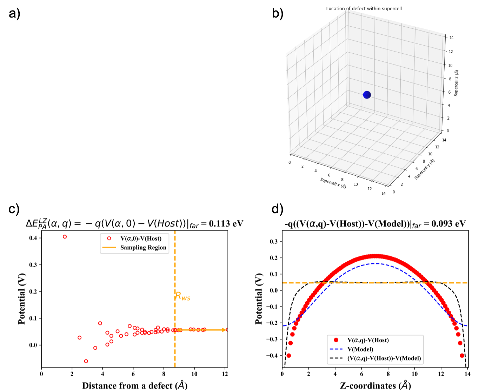

# Summary
The defect physics of a material often plays a decisive role in determining the performance of that material in various optoelectronic devices. First-principles electronic structure calculations of point defects can provide valuable insights into the defect physics of a material to complement experimental measurements [@Freysoldt2014]. The calculated formation energy of a defect in a host material can be used to determine the expected equilibrium concentration of that type of defect when the material is synthesised under particular conditions. The formation energy of a defect can differ considerably when considering the defect in different charge states, it is therefore important to consider the different possible charge states when studying the defect physics of a material. Periodic boundary conditions (PBCs) are usually used by electronic software packages for computationally efficient simulations of solids. However, the use of PBCs results in unphysical artifacts when simulating charged defects in the dilute (non-interacting) limit. As defects are often present in only parts per million of host lattice atoms, this is often the desired regime to simulate.

The supercell approach is a common method to overcome some of the limitations of PBCs for simulating dilute defects, by increasing the distance between defects and their periodic images. The formation energy of charge neutral point defects in a supercell can be obtained by comparing the total energy calculated for the defective supercell to that of an equivalent perfect supercell of the host crystal and then considering the species added to or removed from the perfect supercell when the particular defect is formed [@Zhang1991].
Additional complexities arise when attempting to obtain the formation energy of a charged, isolated point defect. Firstly, there is a strong and long-ranged Coulomb interaction between charged supercells in PBCs and this converges slowly with increased supercell size.
Secondly, the charge of the defect system does not match that of the perfect bulk reference system. It is therefore necessary to introduce an electron chemical potential to account for the change in energy when electrons are added to or removed from the system when creating a defect in a given charge state.
Thirdly, electronic structure calculations with PBCs for a charged unit cell (effectively) include a neutralising homogeneous background charge to avoid infinite charge, which is not present in the calculation for the perfect equivalent supercell [@Freysoldt2014]. Consequently, the expression for the defect formation energy for a charged defect must include additional terms: the charge state of the defect, the position of the Fermi level in the band gap, the energy of the host valence band maximum (VBM), a term used to align the electrostatic potential of the VBM for the host and defect supercells and a final term to account for the remaining finite-size effects that are not eliminated by expanding the unit cell into a supercell. The latter term usually represents multiple corrections performed after the periodic electronic structure calculations, one such correction is that for interactions between a charged defect and its periodic images, the 'image-charge' correction and another is the 'band filling' correction. Various works in the literature provide more thorough descriptions of finite-size effects in periodic electronic structure calculations of charged defect supercells, including references [@Freysoldt2014], [@Lany2009], [@Komsa2012] and [@Durrant2018].

This workflow facilitates the calculation of a finite-size correction term to the defect formation energy for supercells containing charged, intrinsic point defects for periodic electronic structure calculations performed with the all-electron electronic structure software package FHI-aims [@Blum2009]. Within the workflow, this term can be calculated with either the post-processing scheme proposed by Lany and Zunger (LZ) [@Lany2009] or that proposed by Freysoldt, Neugebauer and Van de Walle (FNV) [@Freysoldt2009]. This workflow allows for the scalability of the FHI-aims software package, as demonstrated in [@Levchenko2015] and [@Marek2014], to be utilised when simulating a charged defect embedded in a supercell, where a large system is desirable.
For the potential alignment step, the user has to option to choose between using planar averages of the electrostatic potential or averaged atom-site potentials with the sampling region proposed by Kumagai and Oba [@Kumagai2014] (see Fig. 2a in the publication). Currently, band filling corrections (most relevant for shallow defects with delocalised defect-induced charge) are not available in this workflow. Only image-charge and potential alignment corrections are applied, but the addition of band filling corrections would be an example of a possible extension of this project. Another possible extension would be to allow for the processing of extrinsic point defects (dopants). This workflow has been designed to combine the benefits of step-by-step explanation and transparency of processing steps of a jupyter notebook with scriptability to allow for a convenient, automated application of finite-size corrections to a set of defect structure files. 
There are other existing workflows developed for performing finite-size correction schemes to outputs from other electronic structure softwares such as [@Goyal2017], [@Broberg2018] and [@Naik2018] and this workflow makes use of components of the CoFFEE python code [@Naik2018], which was developed for outputs of the Quantum ESPRESSO software package [@Giannozzi2017] and the pylada-defects python code [@Goyal2017] which was developed for outputs of the VASP software package.

# Defect processing example
The example below shows a visualisation generated with the VESTA software package [@Momma2011] for a supercell of diamond containing a carbon vacancy point defect (a) along with selected outputs from the notebook workflow, including plot of the defect coordinates located by the workflow (b) and potential alignment plots generated using averaged atom-site potentials and the LZ scheme (c) and planar averages of the potential with the FNV scheme (d).

# Acknowledgements
Add mine and Tong's PhD funding info??

# References